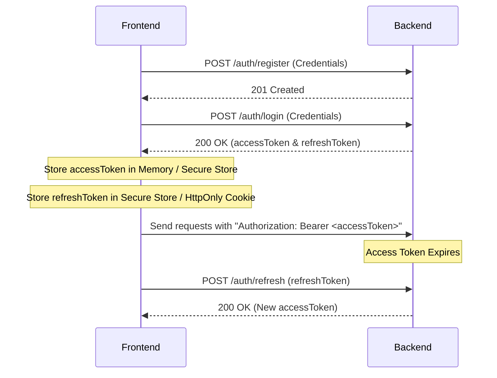

# Fake News Detection Platform - API Integration Documentation

Welcome to the API Integration Guide for the Fake News Detection Platform backend. This documentation is designed to help frontend developers (React Native, Flutter, React.js, Angular, Vue) easily integrate their applications with our high-performance Node.js/TypeScript REST API.

---

## Common Response Format

The backend follows a strict JSON response convention for predictability and ease of parsing.

### Success Response
```json
{
  "success": true,
  "data": {}
}
```

### Error Response
```json
{
  "success": false,
  "message": "Detailed error message describing the failure."
}
```

---

## Status Codes

| Code | Name | Description |
| :--- | :--- | :--- |
| `200` | OK | Request was successful, data is returned. |
| `201` | Created | Resource was successfully created. |
| `400` | Bad Request | Missing or invalid parameters in request body/query/params. |
| `401` | Unauthorized | Missing, invalid, or expired JWT token. |
| `403` | Forbidden | Authenticated, but lacks permissions to access the resource. |
| `404` | Not Found | Requested resource does not exist. |
| `409` | Conflict | Resource already exists (e.g., email duplicate). |
| `422` | Unprocessable Entity | Input validation failed (e.g., Zod validator errors). |
| `500` | Internal Server Error | Server-side exception or database error. |

---

## Authentication Flow



---

# AUTH MODULE

## Register User
### Description
Creates a new user account on the platform.
### URL
`POST /api/v1/auth/register`
### Authentication Required
No
### Headers
```http
Content-Type: application/json
```
### Request Body
```json
{
  "email": "user@example.com",
  "password": "SecurePassword123",
  "name": "Jane Doe"
}
```
| Field | Type | Required | Description |
| :--- | :--- | :--- | :--- |
| `email` | String | Yes | Valid unique email address. |
| `password` | String | Yes | Plaintext password (min 8 characters). |
| `name` | String | Yes | User's full name. |

### Success Response
```json
{
  "success": true,
  "data": {
    "id": "60d0fe4f5311236168a109ca",
    "email": "user@example.com",
    "name": "Jane Doe",
    "createdAt": "2026-06-26T00:00:00.000Z"
  }
}
```
| Field | Type | Description |
| :--- | :--- | :--- |
| `id` | String | MongoDB ObjectId of the created user. |
| `email` | String | Registered email address. |
| `name` | String | Name of the registered user. |
| `createdAt` | ISO Date | Timestamp when the user was created. |

### Error Responses
- **400 Bad Request**: Invalid email format or password too short.
- **409 Conflict**: Email is already registered.
```json
{
  "success": false,
  "message": "Email is already registered"
}
```

### Frontend Notes
- **When to Call**: On user registration screen submission.
- **Storage**: Do not store credentials. Auto-login or redirect to login page.

---

## Login User
### Description
Authenticates user and returns Access Token and Refresh Token.
### URL
`POST /api/v1/auth/login`
### Authentication Required
No
### Headers
```http
Content-Type: application/json
```
### Request Body
```json
{
  "email": "user@example.com",
  "password": "SecurePassword123"
}
```
| Field | Type | Required | Description |
| :--- | :--- | :--- | :--- |
| `email` | String | Yes | Registered email. |
| `password` | String | Yes | User password. |

### Success Response
```json
{
  "success": true,
  "data": {
    "accessToken": "eyJhbGciOiJIUzI1NiIsInR5cCI6IkpXVCJ9...",
    "refreshToken": "eyJhbGciOiJIUzI1NiIsInR5cCI6IkpXVCJ9...",
    "user": {
      "id": "60d0fe4f5311236168a109ca",
      "email": "user@example.com",
      "name": "Jane Doe"
    }
  }
}
```

### Error Responses
- **401 Unauthorized**: Invalid credentials.
```json
{
  "success": false,
  "message": "Invalid email or password"
}
```

### Frontend Notes
- **Storage**: Store `accessToken` in secure memory/state; store `refreshToken` in Secure Store (`flutter_secure_storage`, React Native `Keychain`, or HttpOnly cookie).

---

## Refresh Token
### Description
Generates a new short-lived Access Token using a valid Refresh Token.
### URL
`POST /api/v1/auth/refresh`
### Authentication Required
No
### Headers
```http
Content-Type: application/json
```
### Request Body
```json
{
  "refreshToken": "eyJhbGciOiJIUzI1NiIsInR5cCI6IkpXVCJ9..."
}
```

### Success Response
```json
{
  "success": true,
  "data": {
    "accessToken": "eyJhbGciOiJIUzI1NiIsInR5cCI6IkpXVCJ9..."
  }
}
```

### Frontend Notes
- **When to Call**: Automatically inside an Axios Interceptor when an API call returns `401`.

---

## Logout User
### Description
Invalidates the current refresh token, logging out the user.
### URL
`POST /api/v1/auth/logout`
### Authentication Required
Yes
### Headers
```http
Authorization: Bearer <accessToken>
Content-Type: application/json
```
### Request Body
```json
{
  "refreshToken": "eyJhbGciOiJIUzI1NiIsInR5cCI6IkpXVCJ9..."
}
```

### Success Response
```json
{
  "success": true,
  "data": {
    "message": "Logged out successfully"
  }
}
```

---

## Get User Profile
### Description
Retrieves profile data of the currently logged-in user.
### URL
`GET /api/v1/users/profile`
### Authentication Required
Yes
### Headers
```http
Authorization: Bearer <accessToken>
```

### Success Response
```json
{
  "success": true,
  "data": {
    "id": "60d0fe4f5311236168a109ca",
    "email": "user@example.com",
    "name": "Jane Doe",
    "role": "USER"
  }
}
```

---

# NEWS ANALYSIS MODULE

## Analyze News Content
### Description
Submits news text content for fake news analysis, risk level classification, and automated fact-checking.
### URL
`POST /api/v1/news-analysis`
### Authentication Required
Yes
### Headers
```http
Authorization: Bearer <accessToken>
Content-Type: application/json
```
### Request Body
```json
{
  "content": "Breaking: Governments secretly implement global coffee ban starting next Friday.",
  "title": "Global Coffee Ban Rumors"
}
```
| Field | Type | Required | Description |
| :--- | :--- | :--- | :--- |
| `content` | String | Yes | Raw text content of the news article. |
| `title` | String | No | Optional headline or title. |

### Success Response
```json
{
  "success": true,
  "data": {
    "id": "60d0fe4f5311236168a109cb",
    "classification": "FAKE",
    "confidenceScore": 92,
    "credibilityScore": 15,
    "riskLevel": "HIGH",
    "summary": "Rumors of a global coffee ban are false.",
    "explanation": "No official sources or governments have announced a coffee ban. This is a satirical or malicious rumor.",
    "processingStatus": "COMPLETED",
    "createdAt": "2026-06-26T00:05:00.000Z"
  }
}
```

### Frontend Notes
- Show loading state since Gemini API and pipeline analysis can take 2-4 seconds.

---

## Get News Analysis Detail
### Description
Fetches the detailed analysis report for a specific news article.
### URL
`GET /api/v1/news-analysis/:id`
### Authentication Required
Yes

### Success Response
```json
{
  "success": true,
  "data": {
    "id": "60d0fe4f5311236168a109cb",
    "title": "Global Coffee Ban Rumors",
    "content": "Breaking: Governments secretly implement global coffee ban starting next Friday.",
    "classification": "FAKE",
    "confidenceScore": 92,
    "credibilityScore": 15,
    "riskLevel": "HIGH",
    "summary": "Rumors of a global coffee ban are false.",
    "explanation": "No official sources or governments have announced a coffee ban. This is a satirical or malicious rumor.",
    "processingStatus": "COMPLETED",
    "createdAt": "2026-06-26T00:05:00.000Z"
  }
}
```

---

## Get My Analysis History
### Description
Retrieves a paginated list of all news analysis tasks requested by the logged-in user.
### URL
`GET /api/v1/news-analysis/history/me`
### Authentication Required
Yes

### Success Response
```json
{
  "success": true,
  "data": [
    {
      "id": "60d0fe4f5311236168a109cb",
      "title": "Global Coffee Ban Rumors",
      "classification": "FAKE",
      "riskLevel": "HIGH",
      "createdAt": "2026-06-26T00:05:00.000Z"
    }
  ]
}
```

---

## Delete News Analysis
### Description
Deletes an analysis record from the user's history.
### URL
`DELETE /api/v1/news-analysis/:id`
### Authentication Required
Yes

### Success Response
```json
{
  "success": true,
  "message": "Analysis deleted successfully"
}
```

---

# IMAGE ANALYSIS MODULE

## Analyze Image (OCR + Claim Check)
### Description
Uploads an image containing news or text, processes OCR, and runs automatic news analysis on the extracted text.
### URL
`POST /api/v1/image-analysis/analyze`
### Authentication Required
Yes
### Headers
```http
Authorization: Bearer <accessToken>
Content-Type: multipart/form-data
```
### Request Body (Multipart Form)
- `image`: File (Binary, PNG/JPEG, max 10MB)

### Success Response
```json
{
  "success": true,
  "data": {
    "id": "60d0fe4f5311236168a109cc",
    "imageUrl": "https://res.cloudinary.com/demo/image/upload/v12345/news.jpg",
    "status": "PROCESSING",
    "message": "Image uploaded successfully. Analysis is queued."
  }
}
```

### Frontend Notes
- This uses BullMQ queue on the backend. The analysis is asynchronous. Frontend should poll `GET /api/v1/image-analysis/:id` until the status changes to `COMPLETED`.

---

## Get Image Analysis Result
### Description
Gets status, OCR text, and the linked news analysis for an image upload.
### URL
`GET /api/v1/image-analysis/:id`
### Authentication Required
Yes

### Success Response
```json
{
  "success": true,
  "data": {
    "id": "60d0fe4f5311236168a109cc",
    "imageUrl": "https://res.cloudinary.com/demo/image/upload/v12345/news.jpg",
    "status": "COMPLETED",
    "extractedText": "Official Alert: Vaccine magnetizes human bodies.",
    "linkedAnalysisId": "60d0fe4f5311236168a109cd",
    "createdAt": "2026-06-26T00:06:00.000Z"
  }
}
```

---

## Get Image History
### Description
Gets a list of all images analyzed by the user.
### URL
`GET /api/v1/image-analysis/history/me`
### Authentication Required
Yes

### Success Response
```json
{
  "success": true,
  "data": [
    {
      "id": "60d0fe4f5311236168a109cc",
      "imageUrl": "https://res.cloudinary.com/demo/image/upload/v12345/news.jpg",
      "status": "COMPLETED",
      "createdAt": "2026-06-26T00:06:00.000Z"
    }
  ]
}
```

---

## Delete Image Analysis
### Description
Removes an image analysis record.
### URL
`DELETE /api/v1/image-analysis/:id`
### Authentication Required
Yes

### Success Response
```json
{
  "success": true,
  "message": "Image analysis record deleted successfully"
}
```

---

# CHAT MODULE

## Create Chat Session
### Description
Creates a conversation session. Can be linked to a specific news analysis report.
### URL
`POST /api/v1/chat/sessions`
### Authentication Required
Yes
### Headers
```http
Authorization: Bearer <accessToken>
Content-Type: application/json
```
### Request Body
```json
{
  "title": "Understanding Coffee Ban Rumor",
  "linkedAnalysisId": "60d0fe4f5311236168a109cb"
}
```
| Field | Type | Required | Description |
| :--- | :--- | :--- | :--- |
| `title` | String | No | Optional custom title for the chat. |
| `linkedAnalysisId` | String | No | Optional ID of a news analysis to inject as system context. |

### Success Response
```json
{
  "success": true,
  "data": {
    "id": "60d0fe4f5311236168a109ce",
    "userId": "60d0fe4f5311236168a109ca",
    "title": "Understanding Coffee Ban Rumor",
    "linkedAnalysisId": "60d0fe4f5311236168a109cb",
    "status": "ACTIVE",
    "lastMessageAt": "2026-06-26T00:07:00.000Z"
  }
}
```

---

## Send Chat Message
### Description
Sends a chat message to the assistant. The assistant uses linked news analysis, bias analysis, fact-checks, and history to formulate an objective response.
### URL
`POST /api/v1/chat/sessions/:sessionId/messages`
### Authentication Required
Yes
### Headers
```http
Authorization: Bearer <accessToken>
Content-Type: application/json
```
### Request Body
```json
{
  "message": "Is this rumor confirmed by any reliable news outlet?"
}
```

### Success Response
```json
{
  "success": true,
  "data": {
    "id": "60d0fe4f5311236168a109cf",
    "sessionId": "60d0fe4f5311236168a109ce",
    "role": "ASSISTANT",
    "content": "Based on our comprehensive analysis, no reliable news outlet has confirmed this coffee ban rumor. The official regulatory boards have explicitly denied these claims, classifying them as absolute misinformation.",
    "tokenUsage": 435,
    "aiProvider": "GEMINI",
    "responseTimeMs": 1240,
    "createdAt": "2026-06-26T00:07:02.000Z"
  }
}
```

---

## Get Chat Sessions
### Description
Retrieves all active chat sessions for the logged-in user, sorted by last activity.
### URL
`GET /api/v1/chat/sessions`
### Authentication Required
Yes

### Success Response
```json
{
  "success": true,
  "data": [
    {
      "id": "60d0fe4f5311236168a109ce",
      "title": "Understanding Coffee Ban Rumor",
      "linkedAnalysisId": "60d0fe4f5311236168a109cb",
      "status": "ACTIVE",
      "lastMessageAt": "2026-06-26T00:07:00.000Z"
    }
  ]
}
```

---

## Get Chat Session Messages
### Description
Retrieves a chronological list of all messages within a chat session.
### URL
`GET /api/v1/chat/sessions/:sessionId/messages`
### Authentication Required
Yes

### Success Response
```json
{
  "success": true,
  "data": [
    {
      "id": "60d0fe4f5311236168a109cf-u",
      "role": "USER",
      "content": "Is this rumor confirmed by any reliable news outlet?",
      "createdAt": "2026-06-26T00:07:00.000Z"
    },
    {
      "id": "60d0fe4f5311236168a109cf",
      "role": "ASSISTANT",
      "content": "Based on our comprehensive analysis, no reliable news outlet has confirmed this coffee ban rumor...",
      "createdAt": "2026-06-26T00:07:02.000Z"
    }
  ]
}
```

---

## Delete Chat Session
### Description
Deletes a chat session and all messages associated with it.
### URL
`DELETE /api/v1/chat/sessions/:sessionId`
### Authentication Required
Yes

### Success Response
```json
{
  "success": true,
  "message": "Chat session and messages deleted successfully"
}
```

---

# ADMIN MODULE

## Get Admin Dashboard
### Description
Retrieves key dashboard metrics for administrators.
### URL
`GET /api/v1/admin/dashboard`
### Authentication Required
Yes (Admin Role Required)

### Success Response
```json
{
  "success": true,
  "data": {
    "totalUsers": 1024,
    "totalAnalyses": 5420,
    "activeJobsCount": 3,
    "systemLoad": "healthy"
  }
}
```

---

## Get Platform Users
### Description
Lists all registered users on the platform. Supports pagination.
### URL
`GET /api/v1/admin/users`
### Authentication Required
Yes (Admin Role Required)

### Success Response
```json
{
  "success": true,
  "data": [
    {
      "id": "60d0fe4f5311236168a109ca",
      "name": "Jane Doe",
      "email": "user@example.com",
      "role": "USER"
    }
  ]
}
```

---

## Get Analytics Reports
### Description
Retrieves detailed platform usage data, fake news statistics, and system usage.
### URL
`GET /api/v1/admin/analytics`
### Authentication Required
Yes (Admin Role Required)

### Success Response
```json
{
  "success": true,
  "data": {
    "fakeNewsRate": 34.5,
    "analyzedImagesCount": 1520,
    "averageResponseTimeMs": 1420
  }
}
```

---

## Pagination, Filtering, and Search Standards

For paginated and filterable endpoints (e.g., historical lists, admin queries), the following query parameters are standardized:

### Pagination
- `page`: Page number (1-indexed, default: `1`).
- `limit`: Items per page (default: `10`, max: `100`).
- **Example**: `GET /api/v1/news-analysis/history/me?page=2&limit=20`

### Filtering
- Filters are passed as key-value query parameters.
- **Example**: `GET /api/v1/admin/users?role=ADMIN` or `GET /api/v1/news-analysis/history/me?riskLevel=HIGH`

### Search
- `q`: Search keyword that queries indexed fields (like text content, titles, or names).
- **Example**: `GET /api/v1/news-analysis/history/me?q=coffee`

---

## Frontend Integration Examples

### Axios Implementation
```javascript
import axios from 'axios';

const api = axios.create({
  baseURL: 'http://localhost:5000/api/v1',
  headers: {
    'Content-Type': 'application/json',
  },
});

// Attach JWT access token
api.interceptors.request.use((config) => {
  const token = localStorage.getItem('accessToken'); // use secure store for mobile
  if (token) {
    config.headers.Authorization = `Bearer ${token}`;
  }
  return config;
});

// Automatic token refresh on 401
api.interceptors.response.use(
  (response) => response,
  async (error) => {
    const originalRequest = error.config;
    if (error.response?.status === 401 && !originalRequest._retry) {
      originalRequest._retry = true;
      try {
        const refreshToken = localStorage.getItem('refreshToken');
        const res = await axios.post('http://localhost:5000/api/v1/auth/refresh', { refreshToken });
        const newAccessToken = res.data.data.accessToken;
        localStorage.setItem('accessToken', newAccessToken);
        originalRequest.headers.Authorization = `Bearer ${newAccessToken}`;
        return api(originalRequest);
      } catch (refreshError) {
        // Log out user
        localStorage.removeItem('accessToken');
        localStorage.removeItem('refreshToken');
        window.location.href = '/login';
        return Promise.reject(refreshError);
      }
    }
    return Promise.reject(error);
  }
);
```

### Fetch API Implementation
```javascript
const API_BASE_URL = 'http://localhost:5000/api/v1';

async function fetchWithAuth(endpoint, options = {}) {
  const token = localStorage.getItem('accessToken');
  const headers = {
    'Content-Type': 'application/json',
    ...options.headers,
  };

  if (token) {
    headers['Authorization'] = `Bearer ${token}`;
  }

  const response = await fetch(`${API_BASE_URL}${endpoint}`, {
    ...options,
    headers,
  });

  if (response.status === 401) {
    // Implement token refresh flow here
  }

  return response.json();
}
```

### File Upload Example (multipart/form-data)
```javascript
async function uploadImage(fileUri) {
  const formData = new FormData();
  
  // React Native file structure
  formData.append('image', {
    uri: fileUri,
    type: 'image/jpeg',
    name: 'upload.jpg',
  });

  const response = await fetch(`${API_BASE_URL}/images/analyze`, {
    method: 'POST',
    headers: {
      'Authorization': `Bearer ${localStorage.getItem('accessToken')}`,
      // Note: Do not set Content-Type header manually when using FormData in fetch.
      // The browser/client environment will automatically add the correct boundary.
    },
    body: formData,
  });

  return response.json();
}
```

---

## Best Practices for Mobile Apps

1. **Secure Storage**: Never store JWT access tokens or refresh tokens in insecure locations like React Native `AsyncStorage` or standard key-value storage. Use Secure Store (`expo-secure-store`, `react-native-keychain`, or `flutter_secure_storage`).
2. **Handle Disconnections**: Mobile users change networks frequently. Implement offline checking and retry mechanisms with exponential backoff for background tasks (like checking status).
3. **Optimistic UI Updates**: For chat actions, add the user's message to the state immediately with a local temporary ID to maintain fluid interaction while the API request processes.
4. **SSE vs Polling**: For live chat streams, use Server-Sent Events rather than long-polling, as SSE reduces battery consumption and overhead.
